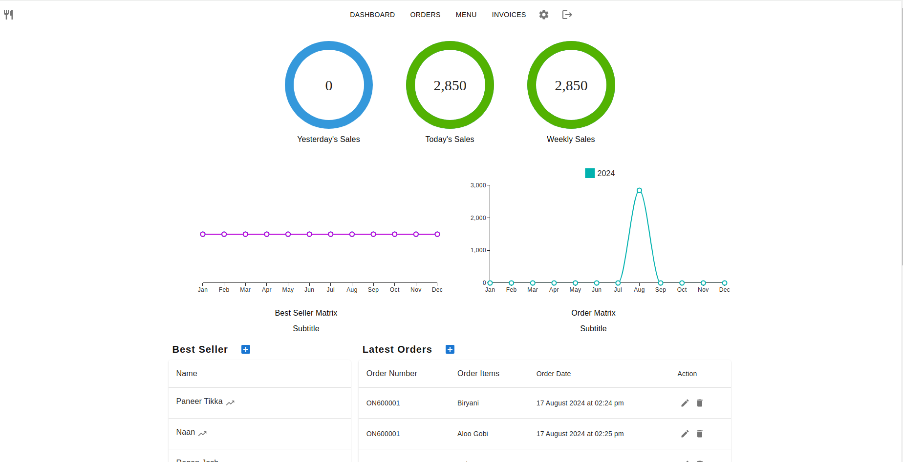

# Food-Circle

**Food-Circle** is an inventory management tool made with ruby on rails, react and material-ui that allows users to:

- View sales statistics
- Create orders
- Manage inventory for their products




Steps to Get started with Food-Circle

* **Run** ```bunlde install```
* **Run** ```./bin/rails javascript:install:esbuild```
* Add changes in package.json file
  ```
  Change this:
  "scripts": {
    "build": "esbuild app/javascript/*.* --bundle --sourcemap --format=esm --outdir=app/assets/builds --public-path=/assets"
  }

  with this:
  "scripts": {
    "build": "esbuild app/javascript/*.* --bundle --sourcemap --format=esm --outdir=app/assets/builds --public-path=/assets --loader:.js=tsx"
  }
  ```
* Add following Environment variables:
  * **DATABASE_USERNAME**
  * **DATABASE_PASSWORD**
  * **DEV_DATABASE_NAME**
  * **TEST_DATABASE_NAME**
  * **JWT_SECRET_KEY**
* Create database
* **Run** db:migrations
* **Run** ```./bin/dev```. This will start the app.


